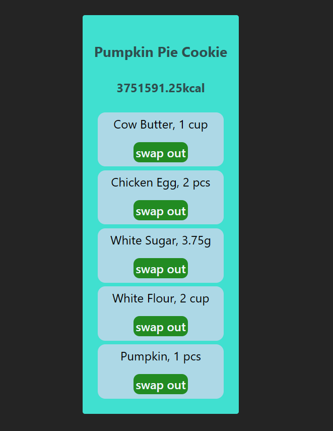
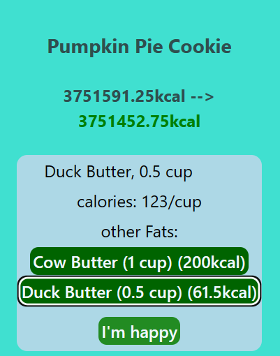

# Crumble

This is my first TS/React project, other than the tic-tac-toe tutorial.

I wanted something that would let me experiment and explore, to help familiarize myself with react, so I came up with the idea of a recipe modifying app.

The app takes a cookie recipe from a JSON file, and provides alternative ingredients for you to use, from a separate ingredients file. In baking, each ingredient does a specific job, and it is important that it is present in a certain ratio with regards to the rest of the ingredients.

Each ingredient has a category, which is its "job" in the recipe. The alternatives suggested are from the same category, and, their amounts are adjusted so that the overall composition of the cookie doesn't change (some ingredients don't need to present in as big an amount to have the same effect).

When swapping the ingredients out, you can also view how they affect the calorie total of the recipe.

